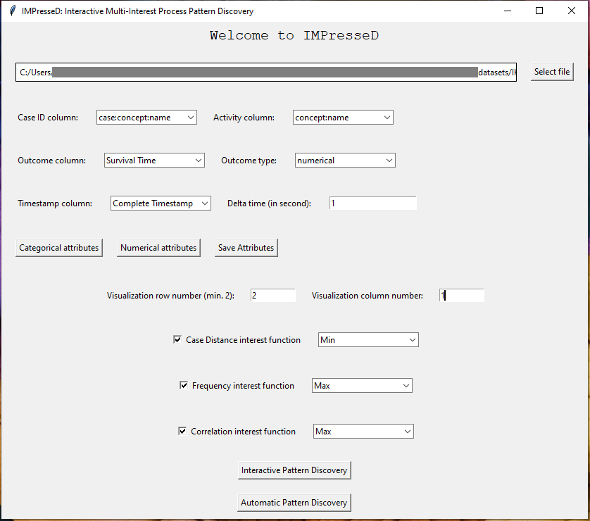

# Interactive Multi-Interest Process Pattern Discovery Tool

This repository provides implementations for discovering outcome-oriented process patterns with three tailored interest functions discussed in paper titled *"Interactive Multi-Interest Process Pattern Discovery"*.

# Usage
To use the implemented tool, you need to have a labeled event log in .cvs format (Use the event log in this repo as exmaple), then clone the projetc and follow the below steps:
1. Install dependencies (Python 3.8.0) :

```pip install -r requirements.txt```

2. Run ```GUI_IMPresseD_tool.py```, then continue the discovery procedure using the GUI:


3. Set and save the required settings and click ```Save Setting```
4. Check desired interest functions (we recommend using all of them) and click ```Interactive Pattern Disocvery``` button button to initiate the tool in interactive mod:


5. Running on a big dataset for the first time would take some time for calculating the pairwise case distances (:coffee:), then you have the results in new window:


6. Select a pattern to extend and check the extended patterns in the new opened window, for exmaple, you will find each pattern and corresponding data in each tab:


