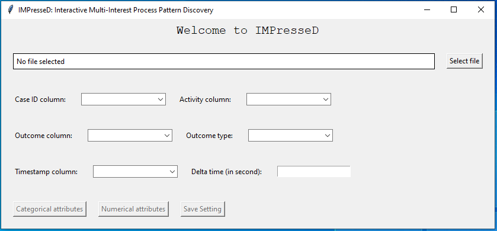

# Interactive Multi-Interest Process Pattern Discovery Tool

This repository provides implementations for discovering outcome-oriented process patterns with three tailored interest functions discussed in paper titled *"Interactive Multi-Interest Process Pattern Discovery" *[[1]](#1).

# Usage
To use the implemented tool, you need to have a labeled event log in .cvs format (Use the event log in this repo as example), then clone the project and follow the below steps.

Install dependencies (Python 3.8.0) :

```pip install -r requirements.txt```

## Interactive Mode
1. Run ```GUI_IMPresseD_tool.py```, then continue the discovery procedure using the GUI:


2. Set the required settings and click ```Save Setting```
3. Check desired interest functions (we recommend using all of them) and click ```Interactive Pattern Disocvery``` button to initiate the tool in interactive mod:


4. Note! Running on a big dataset for the first time would take some time for calculating the pairwise-case distances (:coffee:), then you have the results in new window:


5. Select a pattern to extend and check the extended patterns in the new opened window, for exmaple, you will find each pattern and corresponding data in each tab:


## Automatic Mode
1. Run ```GUI_IMPresseD_tool.py```, then save the settings and check desired interest functions as in the interactive mode.
2. Click ```Automatic Pattern Disocvery``` button to initiate the tool in automatic mod.
3. In this mode, users specify the maximum number of iterations and initiate the pattern discovery process by clicking the designated button.
This mode is optimized to uncover all relevant patterns for prediction purposes. the output of this mode is two test and train set containing the encoded discovered patterns.
During the pattern discovery procedure, we only considered the training set to prevent potential bias or information leakage in the evaluation.


4. Click ```start Automatic Detection``` button and wait to get the results in the chosen directory. You can use the encoded data for training an ML model to predict the outcome of the process.

